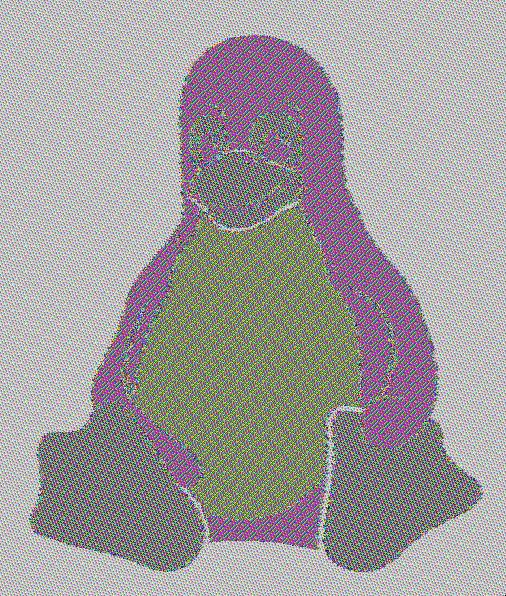

# Cifrados de Bloque – Implementación y Análisis

Este repositorio contiene la implementación de varios cifrados de bloque utilizando Python y la librería **PyCryptodome**, con el objetivo de analizar el comportamiento de diferentes modos de operación y comprender las implicaciones de seguridad de cada uno.

En este proyecto implementé:

* DES en modo ECB con padding PKCS#7 manual
* 3DES en modo CBC con padding de biblioteca
* AES-256 en modos ECB y CBC aplicado al cifrado de imágenes
* Experimentos prácticos para analizar vulnerabilidades de ECB
* Experimentos sobre el uso de IV, padding y tamaños de clave

---

# Estructura del Proyecto

```
BlockCipher-Cifrados
│
├── src
│   ├── utils.py
│   ├── des_cipher.py
│   ├── tripledes_cipher.py
│   ├── aes_cipher.py
│   ├── aes_image_ppm.py
│   └── head_body.py
│
├── images
│   ├── original.png
│   ├── pic_aes_ecb.png
│   └── pic_aes_cbc.png
│
├── requirements.txt
└── README.md
```

---

# Instrucciones de Instalación

## 1. Clonar el repositorio

```bash
git clone https://github.com/usuario/blockcipher-cifrados.git
cd blockcipher-cifrados
```

## 2. Crear entorno virtual (opcional pero recomendado)

```bash
python -m venv venv
```

Activar entorno:

Windows

```bash
venv\Scripts\activate
```

Linux / Mac

```bash
source venv/bin/activate
```

## 3. Instalar dependencias

```bash
pip install -r requirements.txt
```

Dependencias utilizadas:

```
pycryptodome
pillow
```

---

# Instrucciones de Uso

Todos los scripts se encuentran en la carpeta `src`.

Los ejemplos siguientes se ejecutan desde dicha carpeta.

```
cd src
```

---

# Ejemplos de Ejecución

## 1. DES en modo ECB

```bash
python des_cipher.py
```

Ejemplo de salida:

```
Key (hex): 5a9c1c5e5b8d82a1
CT  (hex): 7f94a1a2c2c6c1e7...
PT: b'Hola, DES ECB con padding manual!'
OK: True
```

Este script demuestra:

* Generación de clave DES
* Padding PKCS#7 manual
* Cifrado y descifrado
* Validación de recuperación del mensaje original

---

## 2. 3DES en modo CBC

```bash
python tripledes_cipher.py
```

Salida esperada:

```
Key 2-key len: 16 bytes
Key 3-key len: 24 bytes
CT1 (hex): ...
PT1: b'Hola, 3DES CBC! Probando IV + padding...'
OK: True
IV diferente cada vez?: True
```

Este experimento demuestra:

* Generación de claves de 16 y 24 bytes
* Uso de IV aleatorio
* Uso de padding de biblioteca
* Diferencias entre dos ejecuciones con IV distinto

---

## 3. AES aplicado al cifrado de imágenes

Primero se separa el header y el cuerpo de la imagen PPM.

```bash
python head_body.py
```

Luego se cifra el cuerpo de la imagen con AES.

```bash
python aes_image_ppm.py
```

Esto genera:

```
aes_ecb.ppm
aes_cbc.ppm
aes_cbc.iv
```

Posteriormente se convierten a PNG para visualización:

```bash
python -c "from PIL import Image; Image.open('aes_ecb.ppm').save('pic_aes_ecb.png'); Image.open('aes_cbc.ppm').save('pic_aes_cbc.png')"
```

---

# Proceso de Testing

Durante el desarrollo realicé diferentes pruebas para validar la correcta implementación de cada algoritmo.

## Validación de cifrado y descifrado

Para cada algoritmo se verificó que:

```
plaintext == decrypt(encrypt(plaintext))
```

Esto se comprobó con diferentes tamaños de mensaje.

## Pruebas realizadas

| Prueba        | Objetivo                               |
| ------------- | -------------------------------------- |
| DES ECB       | Validar padding manual                 |
| 3DES CBC      | Validar uso correcto de IV             |
| AES ECB       | Demostrar fuga de patrones             |
| AES CBC       | Confirmar ocultamiento de patrones     |
| Padding PKCS7 | Validar mensajes de diferentes tamaños |

---

# Comparación Visual: ECB vs CBC

El objetivo de esta práctica fue demostrar visualmente por qué **ECB es inseguro para datos estructurados como imágenes**.

Se utilizó una imagen con patrones claros para evidenciar la diferencia.

| Imagen Original          | AES-ECB                     | AES-CBC                     |
| ------------------------ | --------------------------- | --------------------------- |
|  |  |  |

## Observaciones

En la imagen cifrada con **ECB** todavía se distinguen patrones estructurales del contenido original, incluyendo contornos y áreas de color uniforme.

Esto ocurre porque:

* bloques idénticos del mensaje producen bloques cifrados idénticos.

En cambio, con **CBC** los bloques cifrados dependen del bloque anterior y del IV, por lo que la imagen resultante aparece como ruido uniforme sin patrones reconocibles.

Este experimento demuestra claramente que **ECB filtra información estructural incluso sin descifrar el contenido**.

---

# Parte 2 – Análisis de Seguridad

## 2.1 Análisis de Tamaños de Clave

En esta práctica implementé los siguientes tamaños de clave:

| Algoritmo    | Tamaño en bits                     | Tamaño en bytes |
| ------------ | ---------------------------------- | --------------- |
| DES          | 56 bits efectivos (64 con paridad) | 8 bytes         |
| 3DES (2-key) | 112 bits efectivos                 | 16 bytes        |
| 3DES (3-key) | 168 bits efectivos                 | 24 bytes        |
| AES-256      | 256 bits                           | 32 bytes        |

### Generación de claves

A continuación muestro el código utilizado para generar cada clave:

```python
from utils import generate_des_key, generate_3des_key, generate_aes_key

des_key = generate_des_key()
des3_key_2k = generate_3des_key(2)
des3_key_3k = generate_3des_key(3)
aes_key = generate_aes_key(256)

print(len(des_key), "bytes")
print(len(des3_key_2k), "bytes")
print(len(des3_key_3k), "bytes")
print(len(aes_key), "bytes")
```

### ¿Por qué DES es inseguro hoy en día?

DES utiliza una clave efectiva de 56 bits. Esto significa que el espacio total de búsqueda es:

2⁵⁶ ≈ 7.2 × 10¹⁶ combinaciones posibles.

Actualmente, con hardware especializado (como GPUs modernas o clusters distribuidos), es factible realizar ataques de fuerza bruta sobre ese espacio en tiempos razonables.

Por ejemplo, si un sistema pudiera probar 10¹² claves por segundo:

Tiempo ≈ 7.2 × 10¹⁶ / 10¹²
≈ 72,000 segundos
≈ 20 horas

En la práctica, con paralelización, este tiempo puede reducirse aún más. Por esta razón, DES está completamente obsoleto y no debe utilizarse en producción.

En contraste, AES-256 tiene un espacio de clave de:

2²⁵⁶ ≈ 1.16 × 10⁷⁷ combinaciones

Lo cual hace que un ataque de fuerza bruta sea computacionalmente inviable.

---

## 2.2 Comparación de Modos de Operación (ECB vs CBC)

### Modos implementados

* DES: ECB
* 3DES: CBC
* AES: ECB y CBC

### Diferencias fundamentales

**ECB (Electronic Codebook)**:

* Cada bloque se cifra de forma independiente.
* Bloques iguales producen cifrados iguales.
* No utiliza vector de inicialización.
* Filtra patrones estructurales.

**CBC (Cipher Block Chaining)**:

* Cada bloque depende del bloque anterior.
* Requiere un IV.
* Bloques iguales producen cifrados diferentes si cambian los bloques previos.
* Oculta patrones estructurales.

### Evidencia visual

Incluyo las tres imágenes generadas:

| Original                 | AES-ECB                     | AES-CBC                     |
| ------------------------ | --------------------------- | --------------------------- |
|  |  |  |

En la imagen cifrada con ECB todavía se distinguen claramente las siluetas y patrones originales, especialmente en áreas de color uniforme. Esto ocurre porque bloques idénticos del cuerpo de la imagen producen bloques cifrados idénticos.

En CBC, la imagen aparece como ruido uniforme sin patrones reconocibles, ya que cada bloque depende del anterior y del IV.

### Código utilizado

```python
body_ecb = _encrypt_full_blocks_ecb(body, key)
body_cbc = _encrypt_full_blocks_cbc(body, key, iv)
```

Esta comparación demuestra visualmente por qué ECB no es seguro para datos estructurados como imágenes.

---

## 2.3 Vulnerabilidad de ECB

ECB no debe utilizarse en datos sensibles porque preserva patrones estructurales.

### Experimento

Mensaje:

```python
mensaje = b"ATAQUE ATAQUE ATAQUE ATAQUE"
```

Cifrado con AES-ECB:

```python
ct_ecb = encrypt_aes_ecb(mensaje, key)
print(ct_ecb.hex())
```

Al dividir el ciphertext en bloques de 16 bytes se observa que bloques idénticos del mensaje generan bloques cifrados idénticos.

En contraste, con CBC:

```python
iv = generate_iv(16)
ct_cbc = encrypt_aes_cbc(mensaje, key)
print(ct_cbc.hex())
```

Los bloques cifrados son distintos incluso cuando el texto plano se repite.

### Riesgo en escenario real

En un sistema que cifre bases de datos, documentos médicos o imágenes estructuradas usando ECB, un atacante podría:

* Detectar campos repetidos
* Inferir patrones
* Reconstruir parcialmente información sensible

Aunque no pueda descifrar el contenido, sí puede obtener información estadística crítica.

---

## 2.4 Vector de Inicialización (IV)

El IV es un valor aleatorio utilizado en modos encadenados como CBC para garantizar que el mismo mensaje cifrado dos veces produzca resultados distintos.

En ECB no se necesita IV porque cada bloque es independiente.

### Experimento

Cifrando el mismo mensaje con el mismo IV:

```python
iv = generate_iv(16)
ct1 = encrypt_with_given_iv(mensaje, key, iv)
ct2 = encrypt_with_given_iv(mensaje, key, iv)
```

Resultado: `ct1 == ct2`

Cifrando con IV diferente:

```python
iv1 = generate_iv(16)
iv2 = generate_iv(16)

ct1 = encrypt_with_given_iv(mensaje, key, iv1)
ct2 = encrypt_with_given_iv(mensaje, key, iv2)
```

Resultado: `ct1 != ct2`

### Riesgo de reutilizar IV

Si un atacante intercepta múltiples mensajes cifrados con el mismo IV, puede:

* Detectar mensajes idénticos
* Realizar análisis diferencial
* Extraer información estructural

Por ello, el IV debe ser único y aleatorio para cada operación.

---

## 2.5 Padding

El padding es necesario porque los cifrados de bloque requieren que el mensaje tenga longitud múltiplo del tamaño del bloque.

En DES el bloque es de 8 bytes.

### Ejemplos

Mensaje de 5 bytes:

```python
pkcs7_pad(b"HELLO", 8)
```

Resultado:
Se agregan 3 bytes `03 03 03`

Mensaje de 8 bytes exactos:

```python
pkcs7_pad(b"12345678", 8)
```

Resultado:
Se agrega un bloque completo de 8 bytes `08 08 08 08 08 08 08 08`

Mensaje de 10 bytes:

Se agregan 6 bytes `06 06 06 06 06 06`

### Validación

```python
original = b"HELLO"
padded = pkcs7_pad(original, 8)
unpadded = pkcs7_unpad(padded, 8)

print(original == unpadded)
```

Resultado: `True`

---

## 2.6 Recomendaciones de Uso

### Tabla comparativa

| Modo | Seguro    | Usa IV | Paralelizable | Recomendado                      |
| ---- | --------- | ------ | ------------- | -------------------------------- |
| ECB  | No        | No     | Sí            | No                               |
| CBC  | Parcial   | Sí     | No (cifrado)  | Solo con autenticación adicional |
| CTR  | Sí        | Sí     | Sí            | Mejor que CBC                    |
| GCM  | Sí (AEAD) | Sí     | Sí            | Recomendado                      |

### Recomendación actual

En sistemas modernos se recomienda utilizar modos AEAD como:

* AES-GCM
* ChaCha20-Poly1305

Estos modos proveen:

* Confidencialidad
* Integridad
* Autenticación

### Ejemplo en Python (AES-GCM)

```python
from Crypto.Cipher import AES
from Crypto.Random import get_random_bytes

key = get_random_bytes(32)
cipher = AES.new(key, AES.MODE_GCM)
ciphertext, tag = cipher.encrypt_and_digest(b"Mensaje seguro")
```

### Ejemplo en Java

```java
Cipher cipher = Cipher.getInstance("AES/GCM/NoPadding");
SecretKey key = new SecretKeySpec(keyBytes, "AES");
cipher.init(Cipher.ENCRYPT_MODE, key);
byte[] ciphertext = cipher.doFinal(data);
```

---

# Conclusión General

A través de esta implementación pude comprobar experimentalmente que:

* DES es inseguro debido a su tamaño de clave reducido.
* ECB no debe utilizarse en datos estructurados.
* CBC mejora la seguridad pero depende críticamente del IV.
* El padding es necesario y debe implementarse correctamente.
* Los modos modernos como GCM son la opción recomendada en producción.
